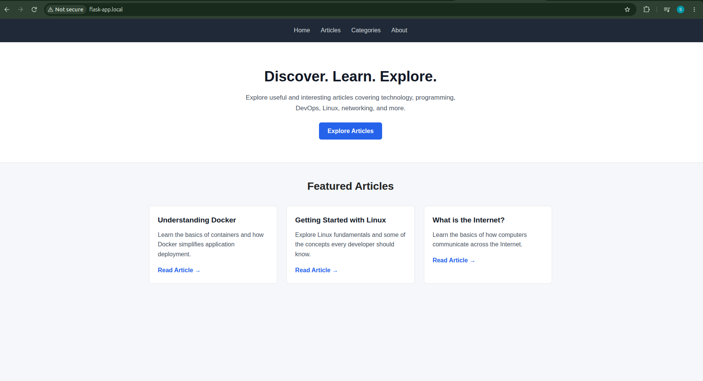
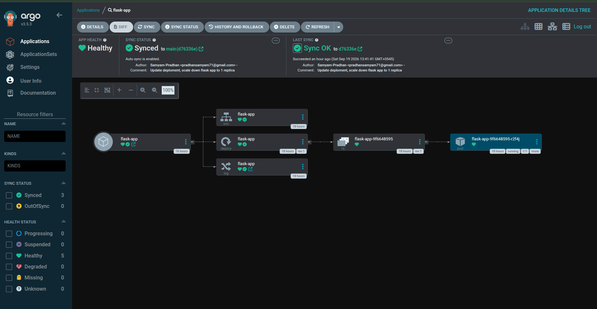

# Flask App — DevOps Project

A Flask web application deployed using a CI/CD and GitOps workflow with Docker, GitHub Actions, Kubernetes, and Argo CD.

### Deployment Flow

Git Push
   ↓
GitHub Actions
   ↓
Build & Push Docker Image
   ↓
Docker Hub
   ↓
Argo CD
   ↓
Kubernetes / Minikube
   ↓
Flask Application

### Flask Application

### Argo CD

